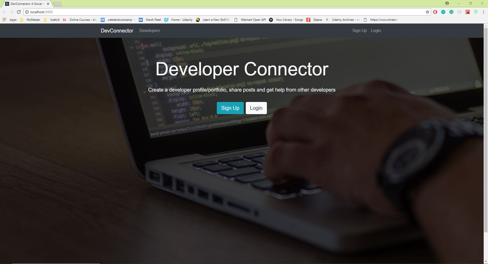

# DevConnector

DevConnector is a platform where developers can connect with other developers. Made using MERN (MongoDB, Express, React/Redux, Node) stack as part of the Udemy Course "MERN Stack Front To Back". 

 

### Running the Application
Note: Make sure you have node and npm package manager installed, if not please visit https://nodejs.org/en/
Run the following commands in git bash or cmd or terminal
1. Clone the repository using command:

```
git clone https://github.com/harshp814/DevConnector.git
```

2. cd into the folder and install dependencies using command:  

```
npm install
```
and
```
npm install client-install
```

3. Once the installation is finished, run the server using command: 

```
npm run dev
```
